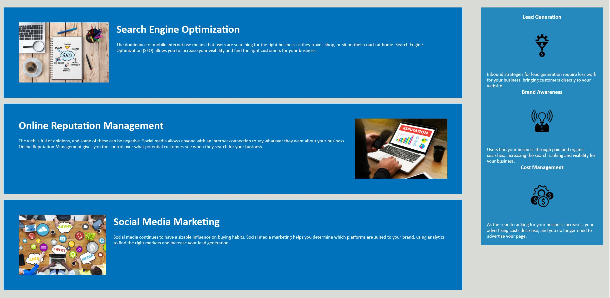

# Horiseon-Code-Refactor

## Summary of Assignment

## Revisions

The first revision I made to the Horiseon website was add a title. I chose "Horiseon - Marketing Solutions" since they were not offering just SEO, but an array of services. I then added comments to both the HTML and CSS files to clean up the code and see where the code for each area of the website. Once that was done I used the inspector tool in Chrome to identify the header, figure, section, aside, and footer of the document. The W3Schools link below on semantics really helped clear this up. 

Now onto cleaning up the code itself. The first redundancy I took care of was the benefits aside. Each individual bullet point had its own class with style for the header and image. I consolidated these down to one class for all of the headers and images. 

At this time I also added alt tags for accessibility. Most of the alt tags were fairly straight forward. The only problem I had involved adding an alt tag to the figure image. Since this was linked in the CSS file and not the HTML I decided to use the img element in HTML and keep the original "figure" class in CSS. That way I could add descriptive text in an "alt" element for accessibility.

Created marketing-specialties class to consolidate the content section. I then replaced the div in the header to nav to follow the correct semantics. I also added a favicon for the website. At this point I realized I did not need to name the class for the main image "figure" since semantically just using the "img" element in the HTML was correct. So I changed the class name to "main-image" so it would be clear for the user what element that class changes. 

The last step was to change the section tag to "main" since this was my main content. I then changed the divs nested in "main" to "section." I revised my "aside" element to match so the divs inside were changed to "section."

## Link
[Deployed Link](https://mikecoletta.github.io/Horiseon-Code-Refactor/)

## Site Screenshot

## Credits

HTML Semantic Elements (https://www.w3schools.com/html/html5_semantic_elements.asp)